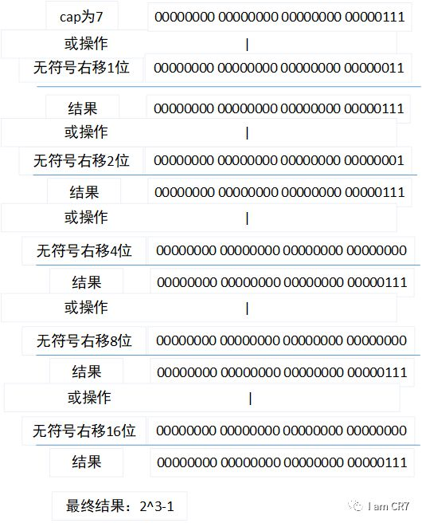
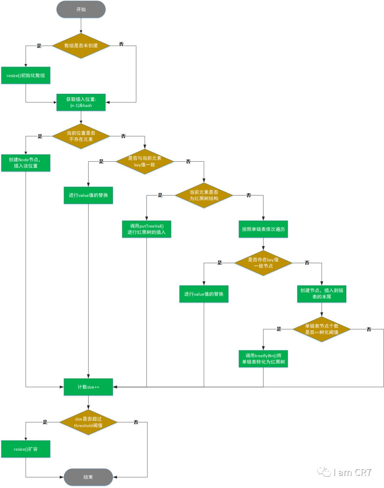

# HashMap
- HashMap 是一个散列表，它存储的内容是键值对(key-value)映射。
- HashMap 继承于AbstractMap，实现了Map、Cloneable、java.io.Serializable接口。
- HashMap 的实现不是同步的，这意味着它不是线程安全的。它的key、value都可以为null。此外，HashMap中的映射不是有序的。

- HashMap 的实例有两个参数影响其性能：“初始容量” 和 “加载因子”。容量 是哈希表中桶的数量，初始容量 只是哈希表在创建时的容量。加载因子 是哈希表在其容量自动增加之前可以达到多满的一种尺度。当哈希表中的条目数超出了加载因子与当前容量的乘积时，则要对该哈希表进行 rehash 操作（即重建内部数据结构），从而哈希表将具有大约两倍的桶数。
- 通常，默认加载因子是 0.75, 这是在时间和空间成本上寻求一种折衷。加载因子过高虽然减少了空间开销，但同时也增加了查询成本（在大多数 HashMap 类的操作中，包括 get 和 put 操作，都反映了这一点）。在设置初始容量时应该考虑到映射中所需的条目数及其加载因子，以便最大限度地减少 rehash 操作次数。如果初始容量大于最大条目数除以加载因子，则不会发生 rehash 操作。

## 1、静态常量

        /**
        * 默认初始大小，值为16，要求必须为2的幂
        */
        static final int DEFAULT_INITIAL_CAPACITY = 1 << 4; 
        
        /**
         * 最大容量，必须不大于2^30
         */
        static final int MAXIMUM_CAPACITY = 1 << 30;
        
        /**
         * 默认加载因子，值为0.75
         */
        static final float DEFAULT_LOAD_FACTOR = 0.75f;
        
        /**
         * hash冲突默认采用单链表存储，当单链表节点个数大于8时，会转化为红黑树存储
         */
        static final int TREEIFY_THRESHOLD = 8;
        
        /**
         * hash冲突默认采用单链表存储，当单链表节点个数大于8时，会转化* 为红黑树存储。当红黑树中节点少于6时，则转化为单链表存储
         */
        static final int UNTREEIFY_THRESHOLD = 6;
        
        /**
         * hash冲突默认采用单链表存储，当单链表节点个数大于8时，会转化*为红黑树存储。但是有一个前提：要求数组长度大于64，否则不会进*行转化
         */
        static final int MIN_TREEIFY_CAPACITY = 64;

- HashMap默认采用数组+单链表方式存储元素，当元素出现哈希冲突时，会存储到该位置的单链表中。但是单链表不会一直增加元素，当元素个数超过8个时，会尝试将单链表转化为红黑树存储。但是在转化前，会再判断一次当前数组的长度，只有数组长度大于64才处理。否则，进行扩容操作。

## 2、构造函数

1、无参构造函数：

    public HashMap() {
        this.loadFactor = DEFAULT_LOAD_FACTOR;
    }

2、带参构造函数，指定初始容量：
        
    public HashMap(int initialCapacity) {
        this(initialCapacity, DEFAULT_LOAD_FACTOR);
    }

3、带参构造函数，指定初始容量和加载因子：

        public HashMap(int initialCapacity, float loadFactor) {
            if (initialCapacity < 0)
                throw new IllegalArgumentException("Illegal initial capacity: " + initialCapacity);
            if (initialCapacity > MAXIMUM_CAPACITY)
               initialCapacity = MAXIMUM_CAPACITY;
            if (loadFactor <= 0 || Float.isNaN(loadFactor))
                throw new IllegalArgumentException("Illegal load factor: " + loadFactor);
            this.loadFactor = loadFactor;
            this.threshold = tableSizeFor(initialCapacity)//通过后面扩容的方法知道，该值就是初始创建数组时的长度
        }

        //返回大于等于cap最小的2的幂，如cap为12，结果就是16
        static final int tableSizeFor(int cap) {
            int n = cap - 1;//为了保证当cap本身是2的幂的情况下，能够返回原本的数，否则返回的是cap的2倍
            n |= n >>> 1;
            n |= n >>> 2;
            n |= n >>> 4;
            n |= n >>> 8;
            n |= n >>> 16;
            return (n < 0) ? 1 : (n >= MAXIMUM_CAPACITY) ? MAXIMUM_CAPACITY : n + 1;
        }

- 下面我们以cap等于8为例：

    1、不减一的过程如下：
        

    最后执行加1操作，那么返回的是2^4=16，是cap的2倍。

    2、减一的过程如下：
        
    最后执行加1操作，那么返回的是2^3=8，也就是cap本身。

    为何数组容量必须是2次幂？
     答：索引计算公式为i = (n - 1) & hash，如果n为2次幂，那么n-1的低位就全是1，哈希值进行与操作时可以保证低位的值不变，从而保证分布均匀，效果等同于hash%n，但是位运算比取余运算要高效的多。

4、带参构造函数，指定Map集合：

    public HashMap(Map<? extends K, ? extends V> m) {
        this.loadFactor = DEFAULT_LOAD_FACTOR;
        putMapEntries(m, false);
    }

    final void putMapEntries(Map<? extends K, ? extends V> m, boolean evict) {
        int s = m.size();
        if (s > 0) {
            if (table == null) { // pre-size
                float ft = ((float)s / loadFactor) + 1.0F;
                int t = ((ft < (float)MAXIMUM_CAPACITY) ?
                    (int)ft : MAXIMUM_CAPACITY);
                if (t > threshold)
                    threshold = tableSizeFor(t);
            }else if (s > threshold)
                resize();
            for (Map.Entry<? extends K, ? extends V> e : m.entrySet()) {
                K key = e.getKey();
                V value = e.getValue();
                putVal(hash(key), key, value, false, evict);
            }
        }
    }

### 添加元素
    public V put(K key, V value) {
        return putVal(hash(key), key, value, false, true);
    }
 
    final V putVal(int hash, K key, V value, boolean onlyIfAbsent,
                   boolean evict) {
        Node<K,V>[] tab; Node<K,V> p; int n, i;
        if ((tab = table) == null || (n = tab.length) == 0)
            n = (tab = resize()).length;
        if ((p = tab[i = (n - 1) & hash]) == null)
            tab[i] = newNode(hash, key, value, null);
        else {
            Node<K,V> e; K k;
            if (p.hash == hash &&
                ((k = p.key) == key || (key != null && key.equals(k))))
                e = p;
            else if (p instanceof TreeNode)
                e = ((TreeNode<K,V>)p).putTreeVal(this, tab, hash, key, value);
            else {
                for (int binCount = 0; ; ++binCount) {
                    if ((e = p.next) == null) {
                        p.next = newNode(hash, key, value, null);
                        if (binCount >= TREEIFY_THRESHOLD - 1) // -1 for 1st
                            treeifyBin(tab, hash);
                        break;
                    }
                    if (e.hash == hash &&
                        ((k = e.key) == key || (key != null && key.equals(k))))
                        break;
                    p = e;
                }
            }
            if (e != null) { // existing mapping for key
                V oldValue = e.value;
                if (!onlyIfAbsent || oldValue == null)
                    e.value = value;
                afterNodeAccess(e);
                return oldValue;
            }
        }
        ++modCount;
        if (++size > threshold)
            resize();
        afterNodeInsertion(evict);
        return null;
    }

#### 流程图

#### hash计算
- 此方式是采用"扰乱函数"的解决方案，将key的哈希值，进行高16位和低16位异或操作，增加低16位的随机性，降低哈希冲突的可能性。

### 扩容

    final Node<K,V>[] resize() {
        Node<K,V>[] oldTab = table;
        int oldCap = (oldTab == null) ? 0 : oldTab.length;
        int oldThr = threshold;
        int newCap, newThr = 0;
        if (oldCap > 0) {
            if (oldCap >= MAXIMUM_CAPACITY) {
                threshold = Integer.MAX_VALUE;
                return oldTab;
            }
            else if ((newCap = oldCap << 1) < MAXIMUM_CAPACITY &&
                     oldCap >= DEFAULT_INITIAL_CAPACITY)
                newThr = oldThr << 1; // double threshold
        }
        else if (oldThr > 0) // initial capacity was placed in threshold
            newCap = oldThr;
        else {               // zero initial threshold signifies using defaults
            newCap = DEFAULT_INITIAL_CAPACITY;
            newThr = (int)(DEFAULT_LOAD_FACTOR * DEFAULT_INITIAL_CAPACITY);
        }
        if (newThr == 0) {
            float ft = (float)newCap * loadFactor;
            newThr = (newCap < MAXIMUM_CAPACITY && ft < (float)MAXIMUM_CAPACITY ?
                      (int)ft : Integer.MAX_VALUE);
        }
        threshold = newThr;
        @SuppressWarnings({"rawtypes","unchecked"})
            Node<K,V>[] newTab = (Node<K,V>[])new Node[newCap];
        table = newTab;
        if (oldTab != null) {
            for (int j = 0; j < oldCap; ++j) {
                Node<K,V> e;
                if ((e = oldTab[j]) != null) {
                    oldTab[j] = null;
                    if (e.next == null)
                        newTab[e.hash & (newCap - 1)] = e;
                    else if (e instanceof TreeNode)
                        ((TreeNode<K,V>)e).split(this, newTab, j, oldCap);
                    else { // preserve order
                        Node<K,V> loHead = null, loTail = null;
                        Node<K,V> hiHead = null, hiTail = null;
                        Node<K,V> next;
                        do {
                            next = e.next;
                            if ((e.hash & oldCap) == 0) {
                                if (loTail == null)
                                    loHead = e;
                                else
                                    loTail.next = e;
                                loTail = e;
                            }
                            else {
                                if (hiTail == null)
                                    hiHead = e;
                                else
                                    hiTail.next = e;
                                hiTail = e;
                            }
                        } while ((e = next) != null);
                        if (loTail != null) {
                            loTail.next = null;
                            newTab[j] = loHead;
                        }
                        if (hiTail != null) {
                            hiTail.next = null;
                            newTab[j + oldCap] = hiHead;
                        }
                    }
                }
            }
        }
        return newTab;
    }

#### 流程图

##### 首次调用扩容方法

情况一：

1、使用无参构造函数：

    HashMap<String, Integer> hashMap = new HashMap<>();

2、put元素，发现table为null，调用resize扩容方法：

    int oldCap = (oldTab == null) ? 0 : oldTab.length;
    int oldThr = threshold;

3、oldCap为0，oldThr为0，执行resize()里的该分支：

    newCap = DEFAULT_INITIAL_CAPACITY;
    newThr = (int)(DEFAULT_LOAD_FACTOR * DEFAULT_INITIAL_CAPACITY);
    threshold = newThr;
    @SuppressWarnings({"rawtypes","unchecked"})
    Node<K,V>[] newTab = (Node<K,V>[])new Node[newCap];
    table = newTab;

4、newCap为16，newThr为12，也就是说HashMap默认数组长度为16，元素添加阈值为12。

5、threshold为12。创建大小为16的数组，赋值给table。

情况二：

1、使用有参构造函数：

    HashMap<String, Integer> hashMap = new HashMap<>(7);

2、oldCap为0，oldThr为8，执行resize()里的该分支：

    else if (oldThr > 0) // initial capacity was placed in threshold
        newCap = oldThr;

3、newCap为8，newThr为0，执行resize()里的该分支：

    if (newThr == 0) {
        float ft = (float)newCap * loadFactor;
        newThr = (newCap < MAXIMUM_CAPACITY && ft < (float)MAXIMUM_CAPACITY ?
                (int)ft : Integer.MAX_VALUE);
    }
    threshold = newThr;
    @SuppressWarnings({"rawtypes","unchecked"})
        Node<K,V>[] newTab = (Node<K,V>[])new Node[newCap];
    9table = newTab;

4、threshold为6。创建大小为8的数组，赋值给table。

##### 非首次调用扩容方法：

- 接着2.2里的情况二，继续添加元素，直到扩容：

1、oldCap为8，oldThr为6，执行resize()里的该分支：

    if (oldCap > 0) {
        if (oldCap >= MAXIMUM_CAPACITY) {
            threshold = Integer.MAX_VALUE;
            return oldTab;
        }
        else if ((newCap = oldCap << 1) < MAXIMUM_CAPACITY &&
                oldCap >= DEFAULT_INITIAL_CAPACITY)
            newThr = oldThr << 1; // double threshold
    }

2、oldCap小于MAXIMUM_CAPACITY，进行2倍扩容，newCap为16。oldCap小于DEFAULT_INITIAL_CAPACITY，不做newThr的扩容，为0，执行resize()里的该分支：

    if (newThr == 0) {
        float ft = (float)newCap * loadFactor;
        newThr = (newCap < MAXIMUM_CAPACITY && ft < (float)MAXIMUM_CAPACITY ?
                  (int)ft : Integer.MAX_VALUE);
    }
    threshold = newThr;
    @SuppressWarnings({"rawtypes","unchecked"})
        Node<K,V>[] newTab = (Node<K,V>[])new Node[newCap];
    table = newTab;
    ..........省略.......//将原数组元素存入新数组中

3、因为newCap小于MAXIMUM_CAPACITY ，ft为newCap*加载因子为12，threshold为12。创建大小为16的数组，赋值给table，并将原数组元素放入新数组中。

- 继续添加元素，直到扩容：

1、oldCap为16，oldThr为12，执行resize()里的该分支：

    if (oldCap > 0) {
        if (oldCap >= MAXIMUM_CAPACITY) {
            threshold = Integer.MAX_VALUE;
            return oldTab;
        }
        else if ((newCap = oldCap << 1) < MAXIMUM_CAPACITY &&
                oldCap >= DEFAULT_INITIAL_CAPACITY)
            newThr = oldThr << 1; // double threshold
    }

2、oldCap小于MAXIMUM_CAPACITY，将数组长度进行2倍扩容，newCap为32。oldCap>=DEFAULT_INITIAL_CAPACITY，将添加元素的阈值也进行2倍扩容，注意此时不再用加载因子去计算阈值，而是随着数组长度进行相应的2倍扩容，threshold为24。

3、创建大小为32的数组，赋值给table，并将原数组元素放入新数组中。

    threshold = newThr;
    @SuppressWarnings({"rawtypes","unchecked"})
        Node<K,V>[] newTab = (Node<K,V>[])new Node[newCap];
    table = newTab;
    ..........省略.......//将原数组元素存入新数组中

- 继续添加元素，扩容到数组长度等于MAXIMUM_CAPACITY：

1、oldCap为MAXIMUM_CAPACITY，执行resize()里的该分支：

    if (oldCap > 0) {
        if (oldCap >= MAXIMUM_CAPACITY) {
            threshold = Integer.MAX_VALUE;
            return oldTab;
        }
        else if ((newCap = oldCap << 1) < MAXIMUM_CAPACITY &&
                oldCap >= DEFAULT_INITIAL_CAPACITY)
            newThr = oldThr << 1; // double threshold
    }

2、因为oldCap等于MAXIMUM_CAPACITY，threshold设置为 Integer.MAX_VALUE，不再扩容，直接返回原数组。此时继续添加元素，Integer.MAX_VALUE+1=Integer.MIN_VALUE，不再大于threshold，则不再进行扩容操作了。

